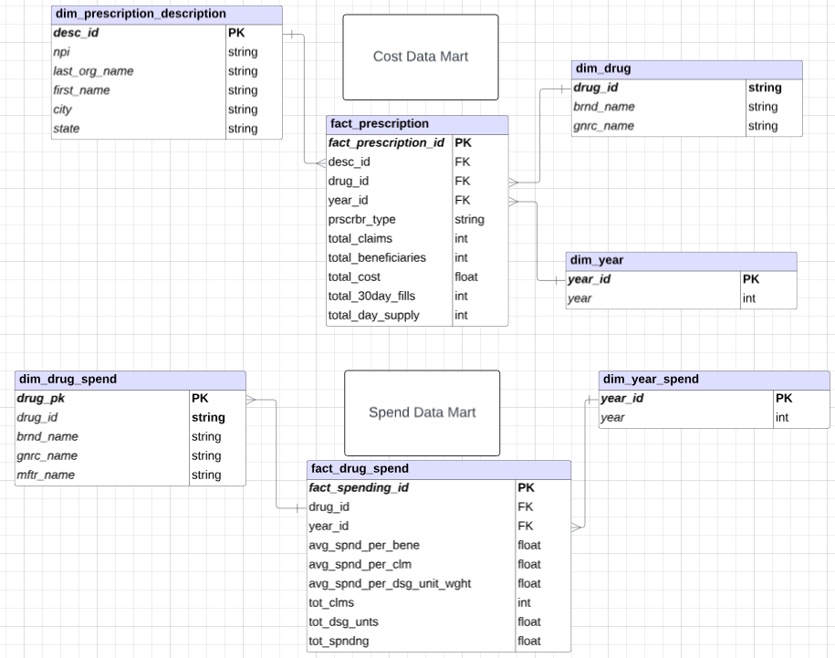
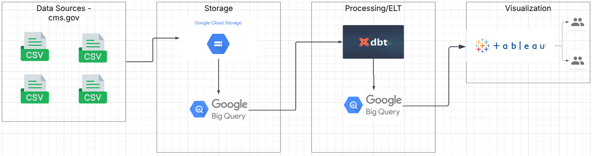
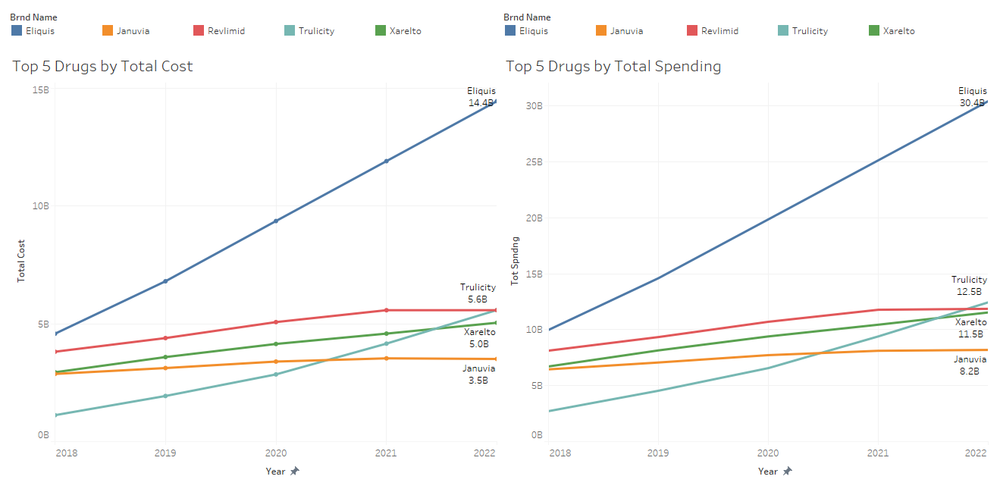
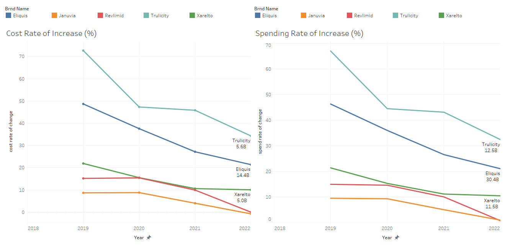
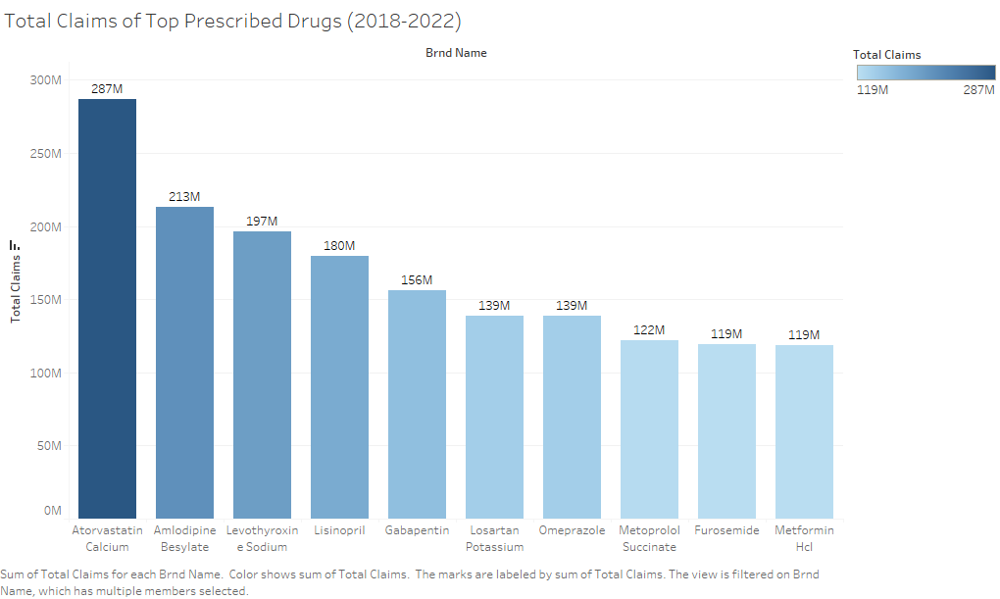
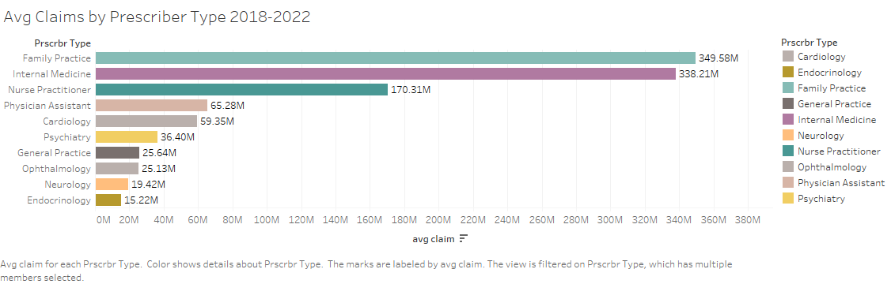
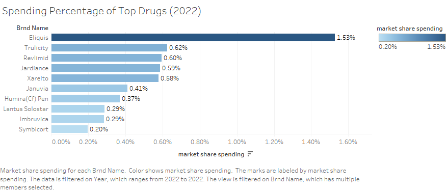
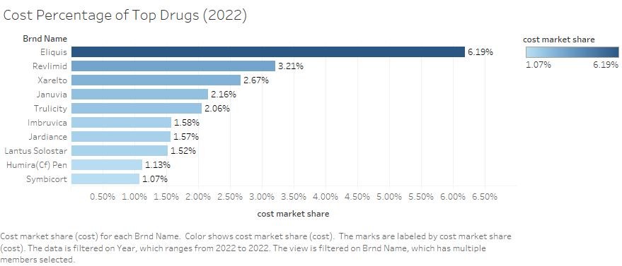
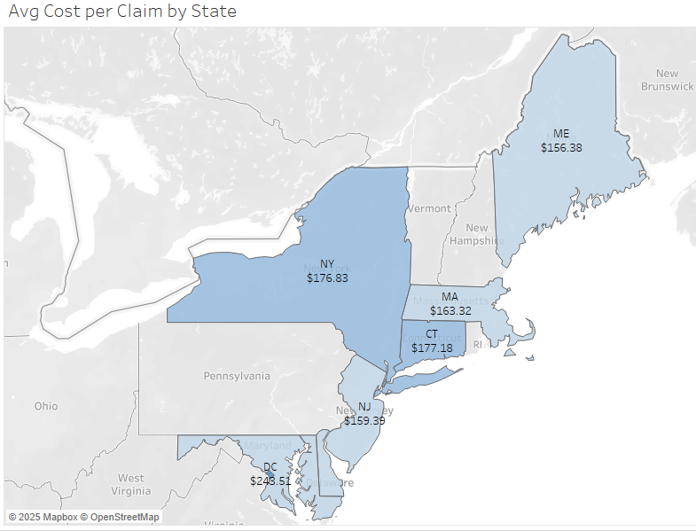
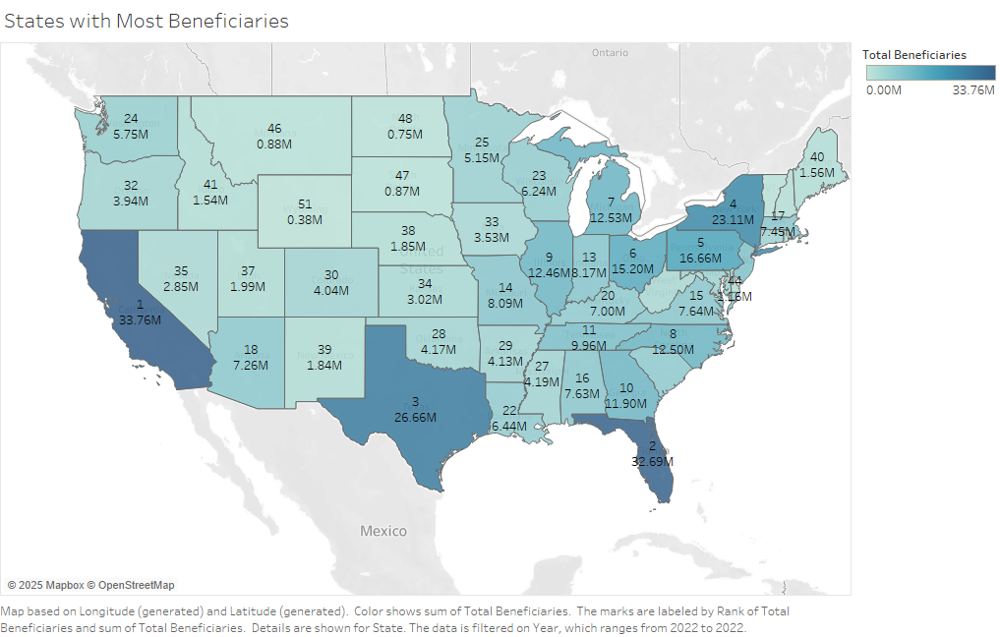

# Medicare Part D - Drug Prescription Analytics Engineering and Analysis (2018-2022)

Table of Contents

- [Project Introduction and Dataset Overview](#project-introduction)
- [Business/Design Requirements and Cleaning Process](#businessdesign-requirements-and-cleaning-process)
- [Data Model (Star Schema)](#data-model-star-schema)
- [Flowchart/System Design](#flowchartsystem-design)
- [Insights and Trends Deep-Dive (insights conducted with queries and visuals in dbt/BigQuery/Tableau)](#insights-and-trends-deep-dive-insights-conducted-with-queries-and-visuals-in-dbtbigquerytableau)
- [Recommendations and Conclusions](#recommendations-and-conclusions)

## Project Introduction
With my knowledge in GCP data services, I designed a data warehouse in BigQuery with the ELT processing done through DBT Cloud. Data sources (4GB csv files with 25m rows each) were stored in Google Cloud Storage and Tableau is integrated with the data warehouse as a visualization tool. The project aims to not only create my own data models from reliable sources of truth (cms.gov), but also to enable myself or anyone to query the data warehouse and visualize insights. 

## Dataset Overview
The dataset consists of Medicare Part D data on Prescription Services and Prescription drugs from 2018-2022 (2022 data is the most recent published data as of 2025). Medicare Part D is a federal program that provides prescription drug coverage for Medicare beneficiaries. Understanding the trends in drug prescriptions, spending, and utilization is crucial for policymakers, healthcare providers, and analysts to ensure cost-effective and equitable access to medication. 

What do the trends look like for the most expensive drug prescriptions? How does state data differ? What can the government do to continue to enable affordable care for US citizens? This project aims to create queryable data models for the purpose of answering these questions based on prescriber, drug, claims, spending, and volume data.

## Business/Design Requirements and Cleaning Process
# 1. Functional
- Pulls data from a single source rather than multiple sources in the system
- Utilizes a bucket storage for annual load so it’s not something that needs to be updated, given its annual nature
- Stores any data type, but structured for CSVs
- Allows for efficient queries through universal data language SQL 

# 2. Non-functional
- Requires reliable government data
- What platform and storage? 
  - Bigquery and Google cloud storage
- What analytics visualization service? 
  - Dabbled with Looker Studio since this was a small project, but found it unintuitive
  - Ended with Tableau for more appealing visuals and familiarity

# 3. Data Cleaning Process
- Cleaned and data profiled with pandas in python
- Wide format reshaped/cleaned into tall format
- Conformed data types if there were mismatch values
- Uploaded into google cloud storage as a data lake
- Source tables transformed into data models with SQL through dbt
- Constant dbt generic testing as well as query ad-hoc testing was conducted to ensure primary key uniqueness and relational integrity for all facts and dimension tables

## Data Model (Star Schema) 
Transformation done in dbt and end tables are stored in BigQuery
Relational integrity maintained through primary and foreign keys - which allows for accurate querying even though BigQuery doesn’t natively support relational integrity
Initially designed an Integrated Data Warehouse based on kimball methodology, but scrapped it as the source data aggregations made it difficult to combine fluidly
After testing out the initial warehouse model, ended up with 2 separate data marts for analysis

## Flowchart/System Design

## Highlights

Key objectives include:
- Exploring prescription trends over time by state, drug category, and prescriber specialties in which the drugs are prescribed.
- Identifying high-cost and high spending trends for medicare drug prescriptions 
- Measuring prescriber activity, top prescribing specialties, and claims volume
- Through these metrics, this project provides valuable insights in drug prescriptions, financial metrics, and cost/spending trends in the Medicare system

Highlights
- The analysis of the data marts show that the total cost of the 5 most expensive drugs have risen exponentially from 2018-2022
- Highest volume of claims comes from cholesterol, blood pressure, and heart medication drugs, which shows a high reliance on chronic disease medication
- HCOL states have high prescription costs, showing price inefficiencies across regions
- Despite the top 10 drugs driving billions in spending, they account for smal percentage of total claims

## Insights and Trends Deep-Dive (insights conducted with queries and visuals in dbt/BigQuery/Tableau)

# 1. Financial Trends
- Total Cost of 5 Most Expensive Drugs
  - Total cost of Eliquis (blood thinner) has grown exponentially (188% over 5 years), costing Medicare from just 4B$ in 2018 to 14.4B$ in 2022
  - The 5 most expensive drugs 1)Eliquis 2)Trulicity 3)Revlimid 4)Xarelto 5)Januvia are all projected to increase, but not as drastically as Eliquis

- Total Spending – The total amount spent on a drug (includes patient, insurer, and Medicare contributions)
  - While not unexpected, the 5 drugs Medicare spends the most on are the same as above with Eliquis spending at 30B$ in 2022 from only 10B$ in 2018
  - Similar to cost trends, spending is expected to increase exponentially for Eliquis, and slightly for the other 4

- Rate of Change in Cost and Spending (%)
  - For the top 5 drugs in cost and spending, rate of increase is slowly falling with the highest rates of increase in 2018-2020 most likely due to covid
  - The rate of increase have fallen throughout the years until 2022, but a rate of increase STILL means prices will continue to rise until growth rate reaches 0

# 2. Claims Volume
- Total Claims (number of times a drug was submitted for request of payment – is a fulfilled prescription) 
  - Based on 5 years of medicare drug data, Atorvastatin Calcium (287M - cholesterol) is the highest prescribed and claimed drug by beneficiaries, followed by Amlodipine (hypertension), Levothyroxine (thyroid), Lisinopril (heart blood pressure)
  - Shows the high reliance of Medicare beneficiaries on cholesterol, blood pressure, thyroid and heart medications

- Annual Average of Claims by Specialty 
  - Family Practice and Internal Medicine are the top 2 specialties with the highest average claims annually (349M and 339M)

# 3. Market Contribution by Drug
- Spending Percentage of top Drugs 
  - Despite the large amount of spending per year on top 10 brand drugs, they only account for less than 1-2% of total spending with Eliquis at 1.5%

- Cost Percentage of top Drugs 
  - Eliquis makes up approx 6% of total Medicare Part D Cost in 2022 followed by Revlimid (3.2%) and Xarelto (2.6%)

# 4. Geographics
- Average Annual Cost per Claim of Top 10 States
  - Highest cost states for prescription claims are in the Northeast and Hawaii
  - Although not a state, as of recent data shows DC as the location with highest cost for prescription claims at $212
CT, HI, and NY state have the next highest average cost per claims 
  - All states are expected to have an upward trend in costs, not just the top 10 most expensive drugs

- Number of Beneficiaries by State 2022
  - California has the most beneficiaries at 33M followed by Florida and Texas
  - It seems a large portion of beneficiaries comes from the east and large states such as California and Texas

## Recommendations and Conclusions

1. Government Policy
- Based on the exponential increase of Eliquis, there shows a need for price regulation based on its high usage and cost
- Should explore generic alternatives and see if prices are similar
- Given that spending is concentrated on a few brand-name drugs, incentives should be provided for production and lowering of generics
- Some states have higher average costs per claim, which may show a need for regulating pricing discrepancies

2. Health Insurance Companies
- Adjust coverage based on medicare spending on certain drugs (ie. Eliquis/Trulicity)
- Incentivize providers to reduce excessive drug spending

3. Pharmaceutical Companies
- Increase transparency on pricing structures in relation to these drugs
- Expand offerings of generic brands
- Focus continued R&D on drugs relating to cardiovascular and cholesterol issues
